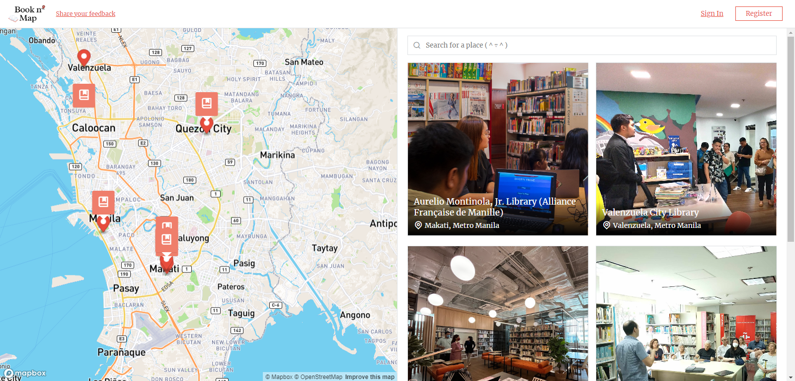
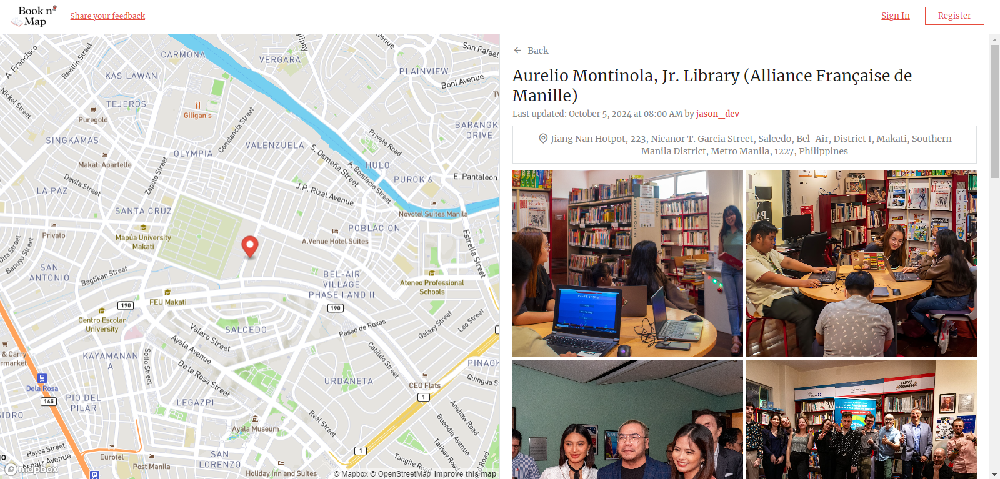
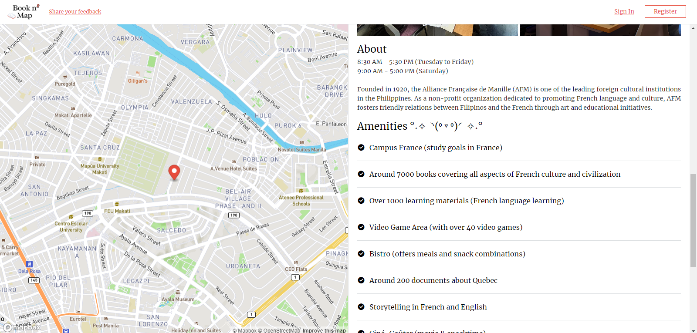
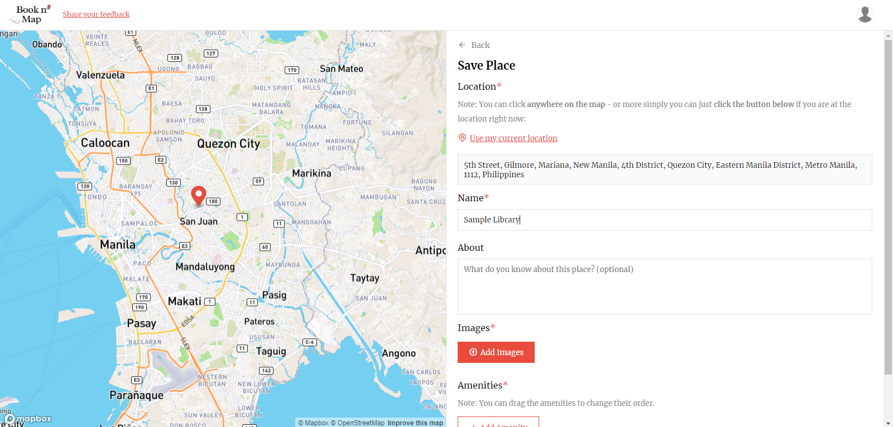
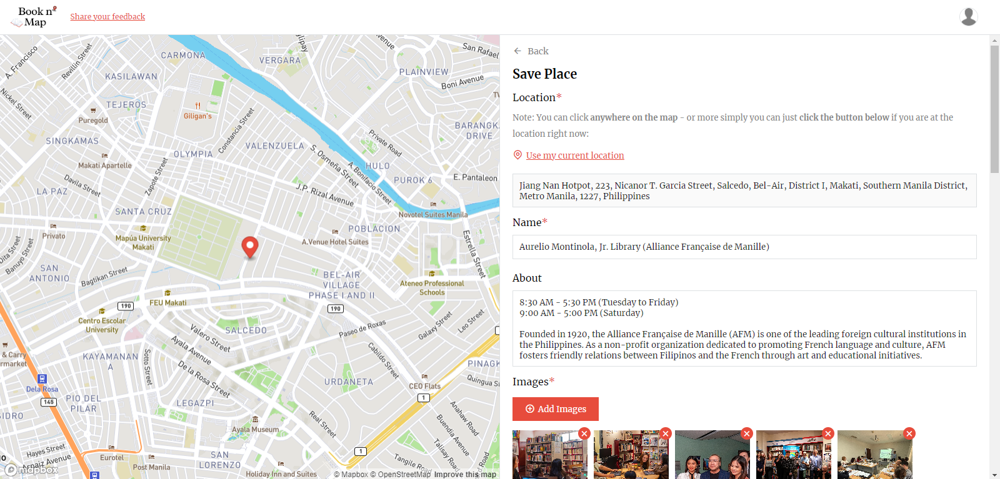
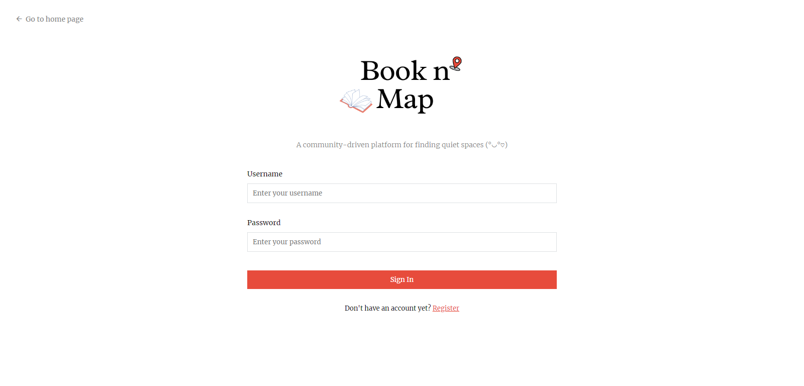
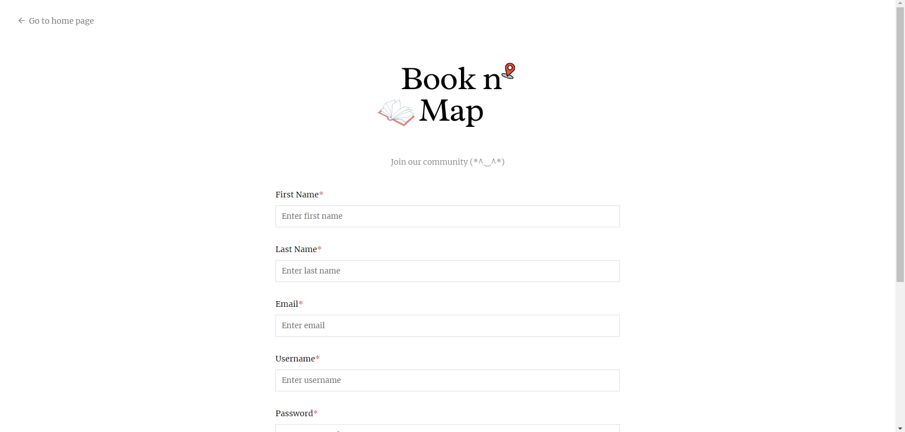

# Book n' Map

**Book n' Map** is a community-driven platform designed to help users discover and share quiet spaces (e.g., libraries). Whether you're a student looking for a peaceful environment
or a book lover in search of new reading spots, Book n' Map helps you find the best places.

## Features

- [x] **Discover Libraries**: Easily search and find libraries.
- [x] **Community Contributions**: Users can submit new places or edit existing places.
- [x] **Map View**: Integrated maps to help users to see the locations of the libraries.

## Tech Stack

**Frontend:**

- HTML
- CSS
- JavaScript
- AJAX (for asynchronous data handling)

**Backend:**

- PHP
- Composer (for PHP dependency management)
- PHPMailer (for sending emails)

**Database:**

- MySQL

**Mapping:**

- Mapbox
- OpenStreetMap (OSM)

## Screenshots

